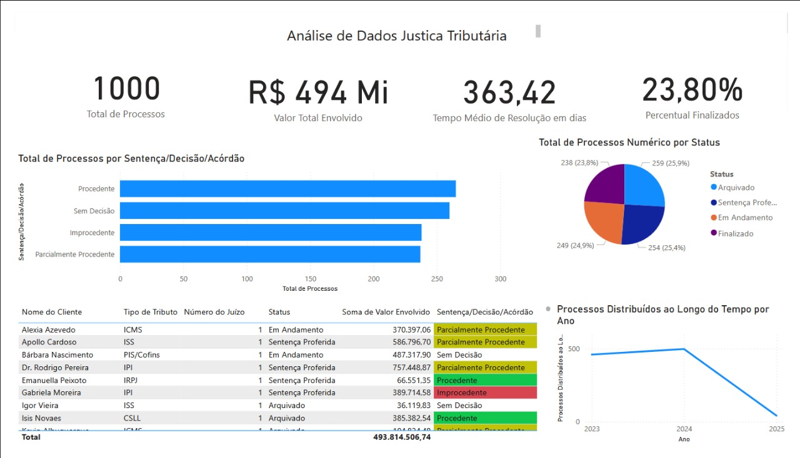

# Projeto de Análise de Dados de Justiça Tributária

Este projeto simula e analisa dados de processos de justiça tributária, utilizando Python para geração e análise de dados, Excel para armazenamento e Power BI para visualização interativa. O objetivo é criar um dashboard que permita explorar métricas como status dos processos, decisões judiciais, valores envolvidos e tempo de resolução.

## Estrutura do Projeto

- **dados/**: Contém a planilha Excel com os dados simulados.
- **scripts/**: Contém os scripts Python para gerar dados e realizar análise exploratória.
- **powerbi/**: Contém o arquivo do Power BI com o dashboard interativo.
- **docs/**: Contém a documentação e relatórios.

## Como Executar o Projeto

### Pré-requisitos

- Python 3.x
- Bibliotecas Python: pandas, numpy, matplotlib, seaborn
- Power BI Desktop

### Passos

1. **Gerar Dados Simulados**:
   - Execute o script `gerar_dados.py` para gerar a planilha `dados_justica_tributaria.xlsx`.

2. **Análise Exploratória**:
   - Execute o script `eda_justica_tributaria.py` para gerar gráficos e estatísticas descritivas.

3. **Visualização no Power BI**:
   - Abra o arquivo `Dashboard_Justica_Tributaria.pbix` no Power BI Desktop para explorar o dashboard interativo.

## Resultados

### Dashboard no Power BI

O dashboard criado no Power BI permite visualizar e interagir com os dados de forma dinâmica. Abaixo está uma captura de tela do dashboard completo:

#### Principais Visualizações:
- **Cartões**: Exibem métricas-chave, como total de processos, valor total envolvido e tempo médio de resolução.
- **Gráficos de Barras**: Mostram a distribuição de status e decisões dos processos.
- **Tabela**: Apresenta detalhes dos processos, como número, cliente, tipo de tributo e valor envolvido.
- **Gráfico de Linhas**: Mostra a evolução temporal dos processos distribuídos.

### Análise Exploratória com Python

A análise exploratória realizada com Python inclui:
- Gráficos de distribuição de valores envolvidos e prazos de audiência.
- Análise de status por tipo de tributo.
- Análise de decisões por vara.

